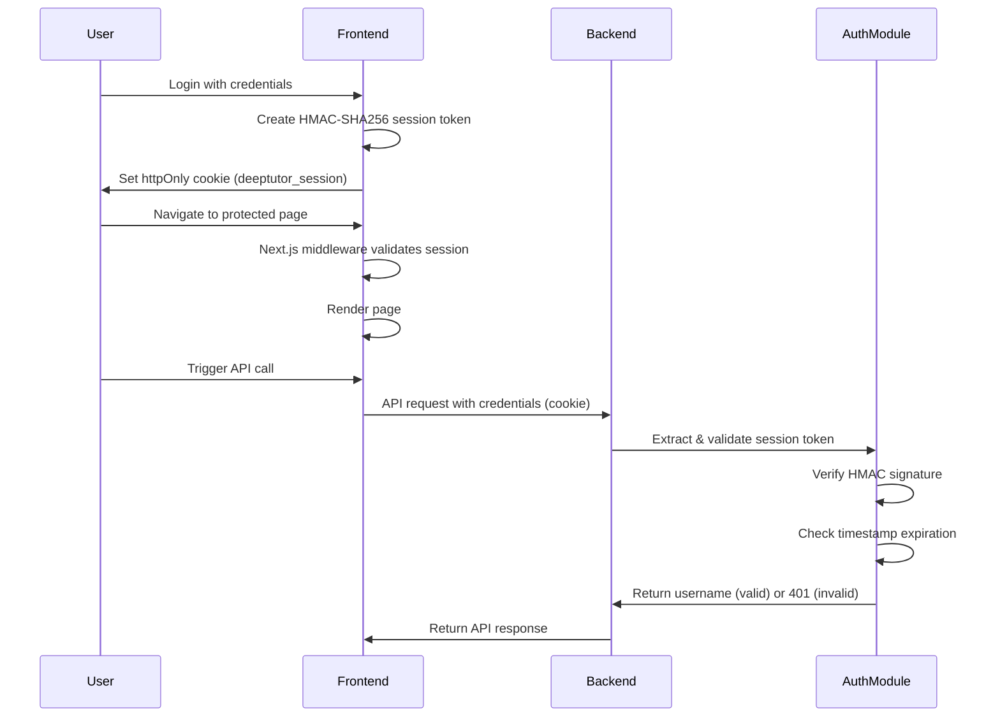

# Feature Architecture: FastAPI Backend Authentication

## 1. Feature Overview

### Problem Statement
The DeepTutor FastAPI backend currently has **no authentication mechanism** on any API endpoints. While the Next.js frontend has proper session-based authentication using HMAC-SHA256 signed tokens, the backend accepts all requests regardless of origin or authentication status. This allows any user to directly call backend endpoints (e.g., `/api/v1/knowledge/add`) without credentials.

### Security Vulnerability Details
- **CORS Configuration**: `allow_origins=["*"]` permits requests from any origin
- **No Auth Middleware**: All API routes are completely open
- **Session Validation Gap**: Frontend validates sessions via Next.js middleware, but backend doesn't verify the session token
- **Attack Vector**: Direct API calls bypass frontend authentication entirely

### Solution Goals
1. Implement session token validation in FastAPI backend
2. Mirror the frontend's HMAC-SHA256 signing mechanism
3. Protect all API routes with authentication dependency
4. Maintain backward compatibility for legitimate frontend requests
5. Ensure WebSocket connections are also authenticated

## 2. Components/Modules Involved

### Backend Components
| Component          | File              | Purpose                                          |
| ------------------ | ----------------- | ------------------------------------------------ |
| Auth Module        | `src/api/auth.py` | Session token validation, HMAC verification      |
| Main App           | `src/api/main.py` | FastAPI app, route registration, auth dependency |
| Environment Config | `.env`            | `APP_SESSION_SECRET` environment variable        |

### Frontend Components
| Component      | File                            | Purpose                                     |
| -------------- | ------------------------------- | ------------------------------------------- |
| API Client     | `web/lib/api.ts`                | Add credentials to fetch/WebSocket requests |
| Global Context | `web/context/GlobalContext.tsx` | Update all API calls to include cookies     |

### Shared Constants
| Constant              | Value                 | Description                   |
| --------------------- | --------------------- | ----------------------------- |
| `SESSION_COOKIE_NAME` | `"deeptutor_session"` | Cookie name for session token |
| `SESSION_TTL_SECONDS` | `43200` (12 hours)    | Session expiration time       |

## 3. High-Level Implementation Steps

### Phase 1: Backend Authentication Module

#### 3.1 Create `src/api/auth.py`
```python
# Session token validation logic mirroring frontend implementation
# - Parse session token from cookie header
# - Validate HMAC-SHA256 signature using APP_SESSION_SECRET
# - Extract and return username from validated token
# - Raise HTTPException(401) for invalid/expired tokens
```

**Key Implementation Details:**
- Token format: `{username}:{timestamp}:{signature}`
- HMAC-SHA256 signature over `{username}:{timestamp}`
- Timestamp validation against SESSION_TTL_SECONDS
- Cookie parsing from request headers

#### 3.2 Create FastAPI Dependency
```python
async def get_current_user(request: Request) -> str:
    """
    Dependency to validate session and return username.
    Usage: @router.get("/endpoint", dependencies=[Depends(get_current_user)])
    """
    # Extract cookie from request
    # Validate token
    # Return username or raise 401
```

#### 3.3 Update `src/api/main.py`
- Import auth dependency
- Apply authentication to all protected routes
- Keep specific routes public (health checks, etc.)
- Consider tightening CORS configuration

### Phase 2: Frontend Integration

#### 3.4 Update API Client (`web/lib/api.ts`)
Add `credentials: 'include'` to all fetch calls:
```typescript
fetch(apiUrl("/api/v1/settings"), {
  credentials: 'include',  // Send session cookie
  headers: { "Content-Type": "application/json" },
})
```

#### 3.5 Update WebSocket Connections
Ensure WebSocket connections include authentication:
```typescript
const ws = new WebSocket(wsUrl("/api/v1/solve"));
// Browser automatically sends cookies with WebSocket
```

#### 3.6 Update All API Calls
Files requiring updates:
- `web/context/GlobalContext.tsx` - All fetch calls
- Any other files making direct API requests

### Phase 3: Router Protection

Apply `get_current_user` dependency to these routers in `main.py`:
- `solve.router` - Problem solving endpoints
- `chat.router` - Chat endpoints
- `question.router` - Question generation endpoints
- `knowledge.router` - Knowledge base management
- `ideagen.router` - Idea generation endpoints
- `notebook.router` - Notebook endpoints
- `settings.router` - Settings endpoints
- `research.router` - Research endpoints
- `cowriter.router` - Co-writer endpoints

**Public Routes (no auth required):**
- Health check endpoints
- Public documentation endpoints

## 4. Architecture Flow



## 5. Security Considerations

### Token Validation
- **Signature Verification**: All tokens must have valid HMAC-SHA256 signature
- **Timestamp Validation**: Tokens older than 12 hours are rejected
- **Cookie Security**: httpOnly, secure (in production), sameSite=lax

### CORS Policy
Current: `allow_origins=["*"]` - **INSECURE**
Recommended: Configure specific allowed origins based on deployment

### Session Management
- Sessions are stateless (no server-side session storage)
- Token contains all necessary information (username + timestamp + signature)
- Revocation requires changing `APP_SESSION_SECRET`

## 6. Environment Variables

| Variable                  | Required | Description                        |
| ------------------------- | -------- | ---------------------------------- |
| `APP_SESSION_SECRET`      | Yes      | Secret key for HMAC-SHA256 signing |
| `APP_LOGIN_USERNAME`      | Yes      | Admin username (for frontend)      |
| `APP_LOGIN_PASSWORD_HASH` | Yes      | Bcrypt hash of admin password      |

## 7. Testing Strategy

### Unit Tests
- Test HMAC signature generation/validation
- Test timestamp expiration logic
- Test cookie parsing

### Integration Tests
- Test authenticated API access
- Test unauthenticated request rejection (401)
- Test expired token handling
- Test WebSocket authentication

### Manual Testing
1. Login to frontend
2. Verify API calls succeed with valid session
3. Delete cookie and verify API calls fail
4. Test direct API access without cookie (should fail)

## 8. Rollback Plan

If issues arise:
1. Revert `src/api/auth.py` deletion
2. Remove auth dependencies from routes in `main.py`
3. Revert frontend credential changes
4. Restart services

## 9. Implementation Checklist

- [ ] Create `src/api/auth.py` with validation logic
- [ ] Implement `get_current_user` dependency
- [ ] Update all router includes in `main.py` with auth dependency
- [ ] Add `credentials: 'include'` to frontend fetch calls
- [ ] Test authentication flow
- [ ] Update documentation

## 10. References

- Frontend auth implementation: `web/lib/auth.ts`
- Frontend auth constants: `web/lib/auth-shared.ts`
- Frontend middleware: `web/middleware.ts`
- FastAPI documentation: https://fastapi.tiangolo.com/tutorial/dependencies/
