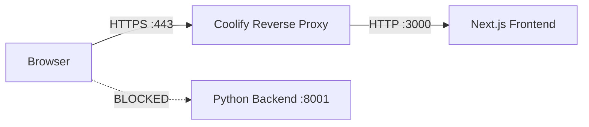
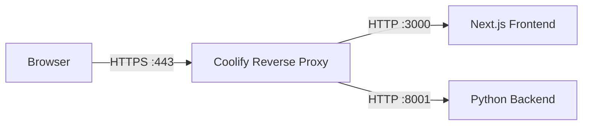

# Feature Architecture: HTTPS API Proxy Strategy

## Feature Overview

Fix the Mixed Content / ERR_SSL_PROTOCOL_ERROR issue when the DeepTutor frontend is served over HTTPS via a reverse proxy (Coolify/Nginx) but the backend API only speaks HTTP on port 8001.

## Problem Statement

The deployment at `https://tutor.workspace.enezatech.com` has this architecture:

The frontend is configured with `NEXT_PUBLIC_API_BASE=http://tutor.workspace.enezatech.com:8001`. When the browser tries to call this:

- **HTTP on :8001** → Blocked by browser as Mixed Content since page is HTTPS
- **HTTPS on :8001** → ERR_SSL_PROTOCOL_ERROR because backend has no TLS

## Solution Strategy

**Use the reverse proxy as the API gateway.** When the page is served over HTTPS, the frontend should send API requests to the **same origin** without a port, letting the reverse proxy handle routing to the backend.

### Two-Part Fix

#### Part 1: Frontend Code Change in web/lib/api.ts

When the page is HTTPS and the configured API URL points to a non-standard port on the same hostname, **strip the port and use HTTPS on the default port 443**. The reverse proxy will handle routing.

**Logic in resolveApiBaseUrl:**
- If page is HTTPS and configured URL is `http://hostname:8001` where hostname matches `window.location.hostname` → use `https://hostname` (no port, goes through proxy on 443)
- If page is HTTPS and configured URL is `http://hostname:8001` where hostname is different → use `https://hostname` (still strip port, assume proxy handles it)
- For localhost URLs, keep as-is since thats local development

#### Part 2: Reverse Proxy Configuration (Coolify)

The Coolify reverse proxy must be configured to route `/api/v1/*` requests to the backend on port 8001. This is an infrastructure change, not a code change.

**If the proxy already routes all traffic to a single container** that runs both frontend and backend (common in Docker deployments), then the Next.js `rewrites` in `next.config.js` can proxy API calls from the frontend server to the backend.

## Components/Modules Involved

| Component          | File                 | Change                                                                     |
| ------------------ | -------------------- | -------------------------------------------------------------------------- |
| API URL Resolution | `web/lib/api.ts`     | Modify `resolveApiBaseUrl` to strip port and use page origin when on HTTPS |
| Next.js Config     | `web/next.config.js` | Add `rewrites` to proxy `/api/v1/*` to backend on port 8001                |
| Environment Config | `web/.env.local`     | No change needed - the code will auto-detect and adapt                     |

## High-Level Implementation Steps

### Step 1: Update resolveApiBaseUrl in web/lib/api.ts

Change the HTTPS upgrade logic: when the page is HTTPS and the configured URL has a non-standard port, **strip the port** and use `https://hostname` instead. The key insight is that port 8001 is an internal port — the browser should never connect to it directly in production. All traffic should go through the reverse proxy on port 443.

### Step 2: Add Next.js API Rewrites in web/next.config.js

Add `rewrites` configuration so that when the Next.js server receives `/api/v1/*` requests, it proxies them to `http://localhost:8001/api/v1/*`. This handles the case where both frontend and backend run in the same Docker network/host.

### Step 3: Verify WebSocket URL handling

Ensure `wsUrl` in `web/lib/api.ts` also correctly uses `wss://hostname` without port when on HTTPS, so WebSocket connections also go through the proxy.

## Decision Log

- **Why not just fix the env var?** The env var `NEXT_PUBLIC_API_BASE` is baked into the Docker image at build time. Changing it requires rebuilding. The code should be smart enough to handle the HTTPS deployment scenario automatically.
- **Why use Next.js rewrites instead of just fixing the URL?** Next.js rewrites act as a server-side proxy, which means the browser makes same-origin requests to the Next.js server, which then forwards them to the backend. This completely avoids Mixed Content issues and doesnt require the reverse proxy to be configured for API routing.
- **Why not use `window.location.origin`?** We do use it — when on HTTPS, we fall back to the page origin, which goes through the proxy.
